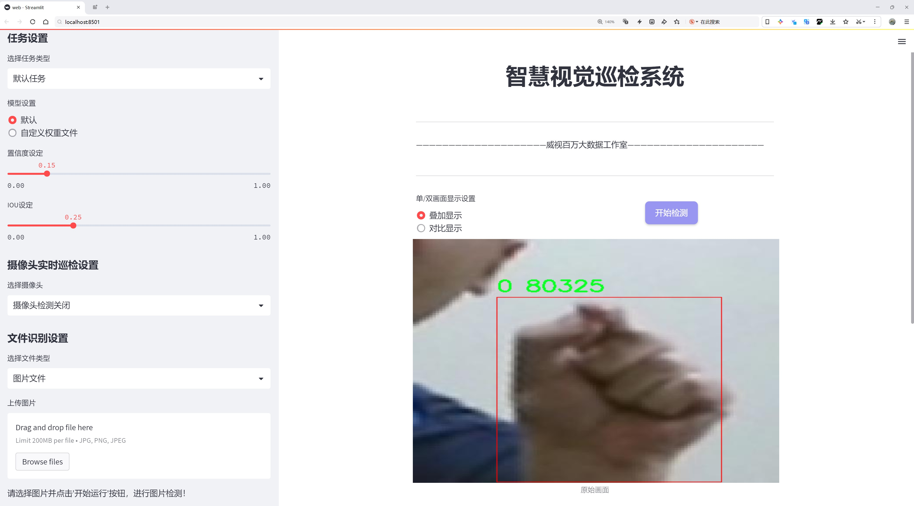
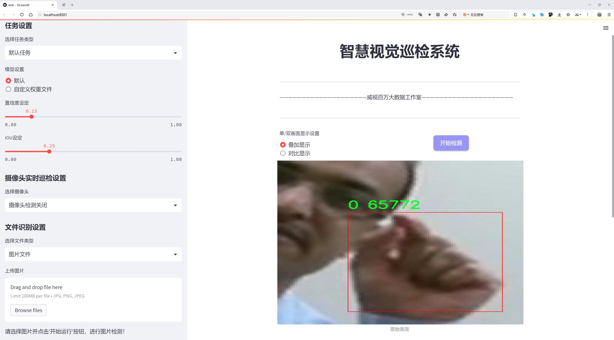
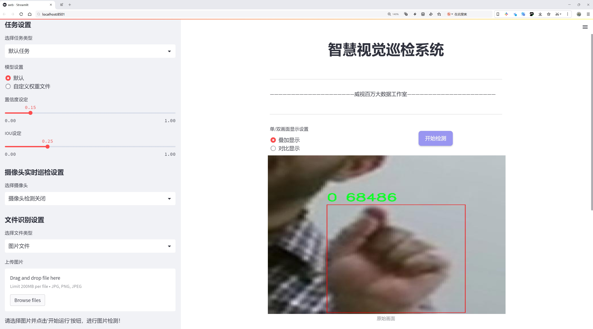
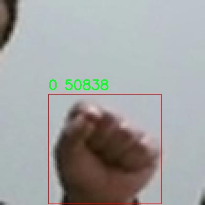
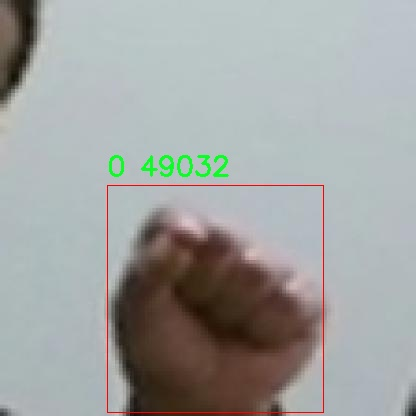
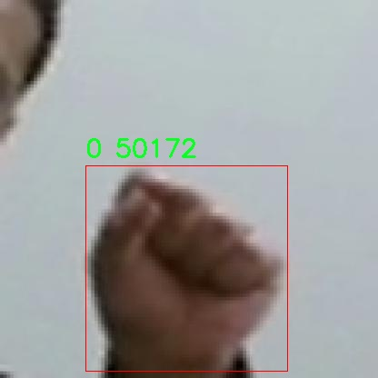
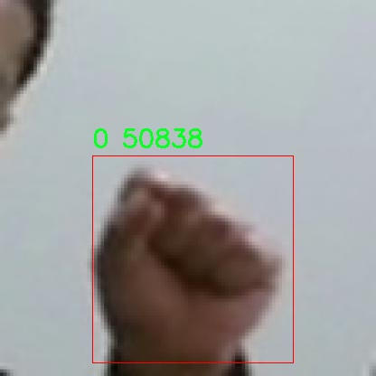
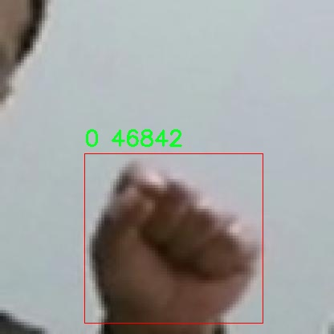

# 握拳手势检测检测系统源码分享
 # [一条龙教学YOLOV8标注好的数据集一键训练_70+全套改进创新点发刊_Web前端展示]

### 1.研究背景与意义

项目参考[AAAI Association for the Advancement of Artificial Intelligence](https://gitee.com/qunmasj/projects)

项目来源[AACV Association for the Advancement of Computer Vision](https://github.com/qunshansj/good)

研究背景与意义

随着人工智能和计算机视觉技术的迅猛发展，手势识别作为人机交互的重要组成部分，逐渐受到广泛关注。手势识别不仅可以提升用户体验，还能在智能家居、虚拟现实、增强现实等领域发挥重要作用。特别是在当前疫情背景下，非接触式交互方式的需求日益增加，手势识别技术的应用前景愈加广阔。握拳手势作为一种常见的手势，其在多种应用场景中具有重要的识别价值，例如在游戏控制、智能设备操控以及人机协作等领域。

在众多手势识别技术中，基于深度学习的目标检测算法表现出了优越的性能。YOLO（You Only Look Once）系列算法因其高效的实时检测能力和较高的准确率，成为手势识别领域的热门选择。YOLOv8作为该系列的最新版本，进一步优化了检测精度和速度，适应了更复杂的应用场景。然而，现有的YOLOv8模型在特定手势的检测上仍存在一定的局限性，尤其是在握拳手势的准确识别和背景复杂度较高的情况下。因此，基于改进YOLOv8的握拳手势检测系统的研究显得尤为重要。

本研究将利用一个包含2042张图像的手势数据集，数据集中包含两类手势，分别为握拳和非握拳手势。这一数据集为模型的训练和测试提供了丰富的样本，有助于提升模型的泛化能力和识别准确率。通过对YOLOv8模型的改进，我们将探索如何在不同光照、背景和手势变形等复杂条件下，提升握拳手势的检测效果。这不仅有助于完善现有的手势识别技术，也为后续的研究提供了重要的理论基础和实践指导。

此外，握拳手势的检测系统在实际应用中具有重要的社会意义。随着智能设备的普及，用户对自然交互方式的需求日益增加。通过实现高效、准确的握拳手势识别，可以为用户提供更加便捷的操作体验，尤其是在智能家居和医疗康复等领域，能够有效提高人机交互的效率和安全性。同时，基于改进YOLOv8的握拳手势检测系统也为相关领域的研究提供了新的思路和方法，推动了手势识别技术的进一步发展。

综上所述，基于改进YOLOv8的握拳手势检测系统的研究，不仅具有重要的学术价值，也具备广泛的应用前景。通过对握拳手势的深入研究，我们希望能够为手势识别技术的发展贡献一份力量，同时为未来的智能交互系统奠定坚实的基础。

### 2.图片演示







##### 注意：由于此博客编辑较早，上面“2.图片演示”和“3.视频演示”展示的系统图片或者视频可能为老版本，新版本在老版本的基础上升级如下：（实际效果以升级的新版本为准）

  （1）适配了YOLOV8的“目标检测”模型和“实例分割”模型，通过加载相应的权重（.pt）文件即可自适应加载模型。

  （2）支持“图片识别”、“视频识别”、“摄像头实时识别”三种识别模式。

  （3）支持“图片识别”、“视频识别”、“摄像头实时识别”三种识别结果保存导出，解决手动导出（容易卡顿出现爆内存）存在的问题，识别完自动保存结果并导出到tempDir中。

  （4）支持Web前端系统中的标题、背景图等自定义修改，后面提供修改教程。

  另外本项目提供训练的数据集和训练教程,暂不提供权重文件（best.pt）,需要您按照教程进行训练后实现图片演示和Web前端界面演示的效果。

### 3.视频演示

[3.1 视频演示](https://www.bilibili.com/video/BV1Z2HYeKEui/?vd_source=ff015de2d29cbe2a9cdbfa7064407a08)

### 4.数据集信息展示

数据集信息展示

在本研究中，我们使用了名为“hands”的数据集，旨在改进YOLOv8模型在握拳手势检测任务中的表现。该数据集专注于手势识别，特别是握拳这一特定手势，提供了丰富的样本以支持模型的训练和验证。数据集的设计和构建经过精心策划，确保其在实际应用中的有效性和可靠性。

“hands”数据集的类别数量为1，具体类别列表仅包含一个标签，即“0”。这一简单的类别设置反映了研究的专注性，强调了对握拳手势的深度学习和识别。尽管类别数量有限，但数据集中的样本数量和多样性足以涵盖握拳手势在不同场景、角度和光照条件下的表现。这种多样性对于训练一个鲁棒的检测系统至关重要，因为它能够帮助模型学习到握拳手势的不同变体，从而提高其在实际应用中的准确性和可靠性。

数据集中的图像经过精心挑选和标注，确保每个样本都准确地反映了握拳手势的特征。每幅图像都经过专业的标注，标注信息包括手势的边界框位置和类别标签。这种详细的标注使得模型在训练过程中能够清晰地识别出握拳手势的具体位置和形态，进而提高检测的精度。此外，数据集还包含了不同人群、性别、肤色和手型的样本，确保模型在多样化的人群中具有良好的适应性。

在数据集的构建过程中，研究团队还考虑到了数据的平衡性和代表性。为了避免模型在训练过程中出现偏倚，数据集中的样本经过严格筛选，确保各类握拳手势的样本数量大致相当。这种平衡性不仅有助于提高模型的泛化能力，还能有效降低过拟合的风险，使得模型在面对未知数据时依然能够保持较高的识别率。

为了进一步增强数据集的实用性，研究团队还采用了数据增强技术，对原始图像进行旋转、缩放、翻转等处理。这些增强操作使得模型能够在训练过程中接触到更多的样本变体，从而提升其对握拳手势的识别能力。这种技术手段在一定程度上弥补了数据集规模的不足，使得模型在面对实际应用时能够更加灵活和适应。

总之，“hands”数据集为改进YOLOv8的握拳手势检测系统提供了坚实的基础。通过精心设计的类别设置、详尽的标注信息和有效的数据增强策略，该数据集不仅能够帮助模型学习到握拳手势的多样性，还能提升其在实际应用中的表现。随着研究的深入和数据集的不断完善，我们期待该系统在握拳手势检测领域取得更为显著的成果，为人机交互、智能监控等应用场景提供更为精准和高效的解决方案。











### 5.全套项目环境部署视频教程（零基础手把手教学）

[5.1 环境部署教程链接（零基础手把手教学）](https://www.ixigua.com/7404473917358506534?logTag=c807d0cbc21c0ef59de5)


[5.2 安装Python虚拟环境创建和依赖库安装视频教程链接（零基础手把手教学）](https://www.ixigua.com/7404474678003106304?logTag=1f1041108cd1f708b01a)

### 6.手把手YOLOV8训练视频教程（零基础小白有手就能学会）

[6.1 环境部署教程链接（零基础手把手教学）](https://www.ixigua.com/7404477157818401292?logTag=d31a2dfd1983c9668658)

### 7.70+种全套YOLOV8创新点代码加载调参视频教程（一键加载写好的改进模型的配置文件）

[7.1 环境部署教程链接（零基础手把手教学）](https://www.ixigua.com/7404478314661806627?logTag=29066f8288e3f4eea3a4)

### 8.70+种全套YOLOV8创新点原理讲解（非科班也可以轻松写刊发刊，V10版本正在科研待更新）

由于篇幅限制，每个创新点的具体原理讲解就不一一展开，具体见下列网址中的创新点对应子项目的技术原理博客网址【Blog】：


[8.1 70+种全套YOLOV8创新点原理讲解链接](https://gitee.com/qunmasj/good)

### 9.系统功能展示（检测对象为举例，实际内容以本项目数据集为准）

图9.1.系统支持检测结果表格显示

  图9.2.系统支持置信度和IOU阈值手动调节

  图9.3.系统支持自定义加载权重文件best.pt(需要你通过步骤5中训练获得)

  图9.4.系统支持摄像头实时识别

  图9.5.系统支持图片识别

  图9.6.系统支持视频识别

  图9.7.系统支持识别结果文件自动保存

  图9.8.系统支持Excel导出检测结果数据


### 10.原始YOLOV8算法原理

原始YOLOv8算法原理

YOLOv8作为YOLO系列目标检测模型的最新版本，继承并改进了前代模型的设计理念，旨在实现更高效、更准确的目标检测。该模型的核心架构分为三个主要部分：Backbone、Neck和Head。每个部分在整体架构中发挥着至关重要的作用，确保了模型在特征提取和目标检测过程中的高效性和准确性。

在Backbone部分，YOLOv8s采用了CSPDarknet（Cross Stage Partial Darknet）结构。这一结构的设计灵感源于对特征提取效率的追求，通过将网络分为两个部分，每个部分都包含多个残差块，CSPDarknet能够有效地增强梯度流动，从而提升模型的学习能力。相较于前代模型YOLOv5，YOLOv8s引入了C2f模块来替代C3模块。C2f模块的设计通过将输入特征图分为两个分支，分别经过卷积层进行降维，形成更高维度的特征图。这种结构不仅保留了重要的特征信息，还通过堆叠分支的方式增强了特征的表达能力。此外，YOLOv8s在Bottleneck层的设计上也进行了创新，采用了v8_C2fBottleneck层，这一层的输出同样被作为分支，进一步丰富了特征图的信息。

在特征提取的过程中，YOLOv8s还引入了快速空间金字塔池化（SPPF）结构。SPPF的主要作用是提取不同尺度的特征，这对于目标检测尤其重要，因为目标的大小和形状各异。通过有效地减少模型的参数量和计算量，SPPF在保证特征提取效率的同时，提升了模型的整体性能。

接下来是Neck部分，YOLOv8s采用了特征金字塔网络（FPN）与路径聚合网络（PAN）的结合。这一结构通过多个卷积层和池化层对特征图进行处理和压缩，能够有效地整合来自不同层次的特征信息。FPN和PAN的结合使得模型在处理复杂场景时，能够更好地捕捉到多尺度的目标特征，从而提升检测的准确性。

在Head部分，YOLOv8s采用了无锚框（Anchor-Free）的检测方式，这一创新显著简化了目标检测的过程。传统的锚框方法依赖于预定义的框来进行目标定位，而YOLOv8s则直接预测目标的中心点及其宽高比例。这种方法不仅减少了锚框的数量，还提高了检测速度和准确度。为了进一步提升模型的性能，YOLOv8s引入了任务对齐学习（Task Alignment Learning，TAL）机制，旨在通过分类分数和IOU的高次幂乘积来衡量任务对齐程度。这一指标的引入，使得模型在分类和定位任务中能够实现更好的协调，从而提升整体的检测效果。

在训练过程中，YOLOv8s对数据增强策略进行了细致的调整。尽管Mosaic数据增强有助于提升模型的鲁棒性和泛化能力，但在训练的最后阶段，YOLOv8s选择停止使用该策略，以避免对数据真实分布的破坏。这一策略的调整反映了YOLOv8s在模型训练中的灵活性和对实际应用场景的适应性。

YOLOv8s的设计理念不仅体现在网络结构的创新上，还在于其对模型性能的追求。通过对比其他YOLO系列模型，YOLOv8在相同尺寸下实现了更高的检测精度和更快的推理速度。这一性能的提升，使得YOLOv8在实际应用中具有更大的价值，尤其是在需要实时性和准确性的任务中，如机器人垃圾分拣系统等。

综上所述，YOLOv8作为YOLO系列的最新版本，通过一系列的结构改进和算法创新，成功地提升了目标检测的效率和准确性。其在特征提取、目标检测和模型训练等多个方面的优化，使得YOLOv8不仅在学术研究中具有重要的参考价值，也在实际应用中展现出广泛的前景。随着目标检测技术的不断发展，YOLOv8无疑将成为一个重要的里程碑，为后续的研究和应用提供了坚实的基础。


### 11.项目核心源码讲解（再也不用担心看不懂代码逻辑）

#### 11.1 ultralytics\utils\callbacks\clearml.py

以下是经过简化和注释的核心代码部分，主要保留了与 ClearML 集成相关的功能。注释详细解释了每个函数的作用和参数。

```python
# 导入必要的库和模块
from ultralytics.utils import LOGGER, SETTINGS, TESTS_RUNNING

# 尝试导入 ClearML 库并进行基本的配置检查
try:
    assert not TESTS_RUNNING  # 确保不在测试环境中
    assert SETTINGS["clearml"] is True  # 确保 ClearML 集成已启用
    import clearml
    from clearml import Task
    from clearml.binding.frameworks.pytorch_bind import PatchPyTorchModelIO
    from clearml.binding.matplotlib_bind import PatchedMatplotlib

    assert hasattr(clearml, "__version__")  # 确保 ClearML 是有效的包

except (ImportError, AssertionError):
    clearml = None  # 如果导入失败，设置 clearml 为 None


def _log_debug_samples(files, title="Debug Samples") -> None:
    """
    记录调试样本（图像）到 ClearML 任务中。

    参数:
        files (list): 文件路径列表，格式为 PosixPath。
        title (str): 用于分组图像的标题。
    """
    import re

    task = Task.current_task()  # 获取当前任务
    if task:
        for f in files:
            if f.exists():  # 检查文件是否存在
                it = re.search(r"_batch(\d+)", f.name)  # 提取批次号
                iteration = int(it.groups()[0]) if it else 0  # 获取迭代次数
                task.get_logger().report_image(
                    title=title, series=f.name.replace(it.group(), ""), local_path=str(f), iteration=iteration
                )  # 记录图像


def on_pretrain_routine_start(trainer):
    """在预训练例程开始时运行；初始化并连接/记录任务到 ClearML。"""
    try:
        task = Task.current_task()  # 获取当前任务
        if task:
            # 禁用自动的 PyTorch 和 Matplotlib 绑定
            PatchPyTorchModelIO.update_current_task(None)
            PatchedMatplotlib.update_current_task(None)
        else:
            # 初始化新的 ClearML 任务
            task = Task.init(
                project_name=trainer.args.project or "YOLOv8",
                task_name=trainer.args.name,
                tags=["YOLOv8"],
                output_uri=True,
                reuse_last_task_id=False,
                auto_connect_frameworks={"pytorch": False, "matplotlib": False},
            )
            LOGGER.warning(
                "ClearML 初始化了一个新任务。如果要远程运行，请在初始化 YOLO 之前添加 clearml-init 并连接您的参数。"
            )
        task.connect(vars(trainer.args), name="General")  # 连接训练参数
    except Exception as e:
        LOGGER.warning(f"警告 ⚠️ ClearML 安装但未正确初始化，未记录此运行。{e}")


def on_train_epoch_end(trainer):
    """在 YOLO 训练的每个 epoch 结束时记录调试样本并报告当前训练进度。"""
    task = Task.current_task()  # 获取当前任务
    if task:
        if trainer.epoch == 1:  # 仅在第一个 epoch 记录调试样本
            _log_debug_samples(sorted(trainer.save_dir.glob("train_batch*.jpg")), "Mosaic")
        # 报告当前训练进度
        for k, v in trainer.label_loss_items(trainer.tloss, prefix="train").items():
            task.get_logger().report_scalar("train", k, v, iteration=trainer.epoch)
        for k, v in trainer.lr.items():
            task.get_logger().report_scalar("lr", k, v, iteration=trainer.epoch)


def on_train_end(trainer):
    """在训练完成时记录最终模型及其名称。"""
    task = Task.current_task()  # 获取当前任务
    if task:
        # 记录最终结果，混淆矩阵 + PR 图
        files = [
            "results.png",
            "confusion_matrix.png",
            "confusion_matrix_normalized.png",
            *(f"{x}_curve.png" for x in ("F1", "PR", "P", "R")),
        ]
        files = [(trainer.save_dir / f) for f in files if (trainer.save_dir / f).exists()]  # 过滤存在的文件
        for f in files:
            _log_plot(title=f.stem, plot_path=f)  # 记录图像
        # 报告最终指标
        for k, v in trainer.validator.metrics.results_dict.items():
            task.get_logger().report_single_value(k, v)
        # 记录最终模型
        task.update_output_model(model_path=str(trainer.best), model_name=trainer.args.name, auto_delete_file=False)


# 定义回调函数，如果 ClearML 可用则启用
callbacks = (
    {
        "on_pretrain_routine_start": on_pretrain_routine_start,
        "on_train_epoch_end": on_train_epoch_end,
        "on_train_end": on_train_end,
    }
    if clearml
    else {}
)
```

### 代码说明：
1. **ClearML集成**：代码通过 `clearml` 库与 ClearML 进行集成，记录训练过程中的各种信息。
2. **调试样本记录**：`_log_debug_samples` 函数用于记录训练过程中的调试图像。
3. **任务初始化**：`on_pretrain_routine_start` 函数在预训练开始时初始化 ClearML 任务，并连接训练参数。
4. **训练进度记录**：`on_train_epoch_end` 函数在每个训练 epoch 结束时记录损失和学习率等信息。
5. **训练结束处理**：`on_train_end` 函数在训练结束时记录最终模型和性能指标。

通过这些核心功能，代码实现了对训练过程的有效监控和记录。

这个文件是一个用于集成 ClearML 的回调函数模块，主要用于在 Ultralytics YOLO 模型训练过程中记录和管理训练任务的相关信息。文件首先导入了一些必要的库和模块，并进行了一些基础的错误处理，以确保 ClearML 库的正确安装和集成。

文件中定义了几个重要的函数。首先是 `_log_debug_samples` 函数，它的作用是将指定的图像文件作为调试样本记录到当前的 ClearML 任务中。函数接收一个文件路径列表和一个标题作为参数，通过正则表达式提取批次信息，并将图像记录到 ClearML 的日志中。

接下来是 `_log_plot` 函数，用于将保存的图像文件作为图表记录到 ClearML 的图表部分。它使用 Matplotlib 库读取图像并创建一个无坐标轴的图形，然后将其记录到当前任务的日志中。

`on_pretrain_routine_start` 函数在预训练例程开始时运行，负责初始化和连接 ClearML 任务。如果当前没有任务，它会创建一个新的任务并连接训练参数。此函数还确保 PyTorch 和 Matplotlib 的自动绑定被禁用，以避免重复记录。

`on_train_epoch_end` 函数在每个训练周期结束时调用，记录调试样本和当前训练进度。在第一次训练周期结束时，它会记录训练样本，并报告当前的损失值和学习率。

`on_fit_epoch_end` 函数在每个训练周期结束时报告模型信息，包括训练时间和验证指标。如果是第一个周期，它还会记录模型的相关信息。

`on_val_end` 函数在验证结束时调用，记录验证结果，包括标签和预测图像。

最后，`on_train_end` 函数在训练完成时调用，记录最终模型及其名称，并将最终的结果和指标记录到 ClearML 中。

文件的最后部分定义了一个 `callbacks` 字典，根据 ClearML 是否可用来选择性地包含这些回调函数，以便在训练过程中进行适当的记录和管理。整体而言，这个文件的目的是通过 ClearML 提供一个系统化的方式来跟踪和记录 YOLO 模型的训练过程。

#### 11.2 ultralytics\utils\callbacks\comet.py

以下是经过简化和注释的核心代码部分：

```python
# 导入必要的库
from ultralytics.utils import LOGGER, RANK, SETTINGS, ops
import os
from pathlib import Path

# 尝试导入 Comet ML 库并进行基本的配置检查
try:
    assert SETTINGS["comet"] is True  # 确保集成已启用
    import comet_ml
    assert hasattr(comet_ml, "__version__")  # 确保包不是目录
except (ImportError, AssertionError):
    comet_ml = None  # 如果导入失败，则将 comet_ml 设置为 None

def _get_comet_mode():
    """获取环境变量中设置的 Comet 模式，默认为 'online'。"""
    return os.getenv("COMET_MODE", "online")

def _create_experiment(args):
    """创建 Comet 实验对象，仅在分布式训练的主进程中创建。"""
    if RANK not in (-1, 0):  # 仅在主进程中执行
        return
    try:
        comet_mode = _get_comet_mode()
        project_name = os.getenv("COMET_PROJECT_NAME", args.project)
        experiment = comet_ml.Experiment(project_name=project_name) if comet_mode != "offline" else comet_ml.OfflineExperiment(project_name=project_name)
        experiment.log_parameters(vars(args))  # 记录参数
    except Exception as e:
        LOGGER.warning(f"WARNING ⚠️ Comet 安装但未正确初始化，未记录此运行。{e}")

def on_train_epoch_end(trainer):
    """在每个训练周期结束时记录指标和保存批次图像。"""
    experiment = comet_ml.get_global_experiment()  # 获取当前的 Comet 实验
    if not experiment:
        return

    curr_epoch = trainer.epoch + 1  # 当前周期
    curr_step = curr_epoch * (len(trainer.train_loader.dataset) // trainer.batch_size)  # 当前步骤

    # 记录训练损失指标
    experiment.log_metrics(trainer.label_loss_items(trainer.tloss, prefix="train"), step=curr_step, epoch=curr_epoch)

def on_train_end(trainer):
    """在训练结束时执行操作。"""
    experiment = comet_ml.get_global_experiment()  # 获取当前的 Comet 实验
    if not experiment:
        return

    curr_epoch = trainer.epoch + 1  # 当前周期
    curr_step = curr_epoch * (len(trainer.train_loader.dataset) // trainer.batch_size)  # 当前步骤

    # 结束实验并记录相关信息
    experiment.end()

# 定义回调函数
callbacks = {
    "on_train_epoch_end": on_train_epoch_end,
    "on_train_end": on_train_end,
} if comet_ml else {}
```

### 代码注释说明：
1. **导入库**：导入必要的库和模块，包括 `comet_ml` 用于实验记录。
2. **异常处理**：在尝试导入 `comet_ml` 时进行异常处理，以确保程序的健壮性。
3. **获取 Comet 模式**：定义 `_get_comet_mode` 函数，用于获取当前的 Comet 模式。
4. **创建实验**：定义 `_create_experiment` 函数，确保实验对象仅在主进程中创建，并记录相关参数。
5. **训练周期结束**：在 `on_train_epoch_end` 函数中记录每个训练周期结束时的指标。
6. **训练结束**：在 `on_train_end` 函数中结束实验并记录最终信息。
7. **回调函数**：定义回调函数集合，用于在训练过程中调用。

这个程序文件是一个用于集成 Comet.ml 的回调模块，主要用于在训练 YOLOv8 模型时记录和可视化训练过程中的各种信息。文件首先导入了一些必要的库和模块，并进行了基本的环境检查，确保 Comet.ml 被正确安装和配置。

文件中定义了一系列的辅助函数，这些函数的功能包括获取环境变量中的配置、格式化预测和真实标签的注释、记录混淆矩阵、记录图像及其预测结果等。通过这些函数，程序能够在训练过程中自动记录各种指标和图像，方便后续的分析和可视化。

在训练开始时，程序会创建或恢复一个 Comet.ml 实验，并在每个训练周期结束时记录当前的训练指标，包括损失值和其他相关的度量。在每个适应性训练周期结束时，程序会记录模型的状态、混淆矩阵以及图像预测结果。最后，在训练结束时，程序会执行一些清理操作，比如结束 Comet 实验并重置图像预测计数。

此外，程序中还包含了一些特定于 YOLOv8 的功能，比如处理图像的缩放和边界框的转换，以确保记录的数据与实际的图像和模型输出一致。整体来看，这个模块通过与 Comet.ml 的集成，提供了一种高效的方式来监控和分析 YOLOv8 模型的训练过程。

#### 11.3 ultralytics\models\sam\modules\decoders.py

以下是代码中最核心的部分，并附上详细的中文注释：

```python
import torch
from torch import nn
from typing import Tuple

class MaskDecoder(nn.Module):
    """
    MaskDecoder类用于生成掩码及其质量评分，使用变换器架构根据图像和提示嵌入预测掩码。
    """

    def __init__(self, transformer_dim: int, transformer: nn.Module, num_multimask_outputs: int = 3) -> None:
        """
        初始化MaskDecoder。

        参数:
            transformer_dim (int): 变换器模块的通道维度
            transformer (nn.Module): 用于预测掩码的变换器
            num_multimask_outputs (int): 预测的掩码数量
        """
        super().__init__()
        self.transformer_dim = transformer_dim  # 变换器的通道维度
        self.transformer = transformer  # 变换器模块

        self.num_multimask_outputs = num_multimask_outputs  # 多掩码输出的数量

        # 定义IoU token的嵌入
        self.iou_token = nn.Embedding(1, transformer_dim)
        # 定义掩码token的数量（包括IoU token）
        self.num_mask_tokens = num_multimask_outputs + 1
        self.mask_tokens = nn.Embedding(self.num_mask_tokens, transformer_dim)  # 掩码token的嵌入

        # 输出上采样网络
        self.output_upscaling = nn.Sequential(
            nn.ConvTranspose2d(transformer_dim, transformer_dim // 4, kernel_size=2, stride=2),
            nn.LayerNorm(transformer_dim // 4),
            nn.GELU(),
            nn.ConvTranspose2d(transformer_dim // 4, transformer_dim // 8, kernel_size=2, stride=2),
            nn.GELU(),
        )

        # 定义用于生成掩码的超网络MLP
        self.output_hypernetworks_mlps = nn.ModuleList(
            [MLP(transformer_dim, transformer_dim, transformer_dim // 8, 3) for _ in range(self.num_mask_tokens)]
        )

        # 定义用于预测掩码质量的MLP
        self.iou_prediction_head = MLP(transformer_dim, 256, self.num_mask_tokens, 3)

    def forward(
        self,
        image_embeddings: torch.Tensor,
        image_pe: torch.Tensor,
        sparse_prompt_embeddings: torch.Tensor,
        dense_prompt_embeddings: torch.Tensor,
        multimask_output: bool,
    ) -> Tuple[torch.Tensor, torch.Tensor]:
        """
        根据图像和提示嵌入预测掩码。

        参数:
            image_embeddings (torch.Tensor): 图像编码器的嵌入
            image_pe (torch.Tensor): 图像嵌入的位置信息
            sparse_prompt_embeddings (torch.Tensor): 稀疏提示的嵌入
            dense_prompt_embeddings (torch.Tensor): 密集提示的嵌入
            multimask_output (bool): 是否返回多个掩码

        返回:
            torch.Tensor: 预测的掩码
            torch.Tensor: 掩码质量的预测
        """
        masks, iou_pred = self.predict_masks(
            image_embeddings=image_embeddings,
            image_pe=image_pe,
            sparse_prompt_embeddings=sparse_prompt_embeddings,
            dense_prompt_embeddings=dense_prompt_embeddings,
        )

        # 根据是否需要多个掩码选择正确的掩码
        mask_slice = slice(1, None) if multimask_output else slice(0, 1)
        masks = masks[:, mask_slice, :, :]
        iou_pred = iou_pred[:, mask_slice]

        return masks, iou_pred  # 返回掩码和IoU预测

    def predict_masks(
        self,
        image_embeddings: torch.Tensor,
        image_pe: torch.Tensor,
        sparse_prompt_embeddings: torch.Tensor,
        dense_prompt_embeddings: torch.Tensor,
    ) -> Tuple[torch.Tensor, torch.Tensor]:
        """
        预测掩码。

        参数:
            image_embeddings (torch.Tensor): 图像编码器的嵌入
            image_pe (torch.Tensor): 图像嵌入的位置信息
            sparse_prompt_embeddings (torch.Tensor): 稀疏提示的嵌入
            dense_prompt_embeddings (torch.Tensor): 密集提示的嵌入

        返回:
            torch.Tensor: 预测的掩码
            torch.Tensor: 掩码质量的预测
        """
        # 连接输出token
        output_tokens = torch.cat([self.iou_token.weight, self.mask_tokens.weight], dim=0)
        output_tokens = output_tokens.unsqueeze(0).expand(sparse_prompt_embeddings.size(0), -1, -1)
        tokens = torch.cat((output_tokens, sparse_prompt_embeddings), dim=1)

        # 扩展每个图像的数据以适应每个掩码
        src = torch.repeat_interleave(image_embeddings, tokens.shape[0], dim=0)
        src = src + dense_prompt_embeddings
        pos_src = torch.repeat_interleave(image_pe, tokens.shape[0], dim=0)

        # 运行变换器
        hs, src = self.transformer(src, pos_src, tokens)
        iou_token_out = hs[:, 0, :]  # IoU token的输出
        mask_tokens_out = hs[:, 1 : (1 + self.num_mask_tokens), :]  # 掩码token的输出

        # 上采样掩码嵌入并使用掩码token预测掩码
        src = src.transpose(1, 2).view(src.shape[0], src.shape[1], -1)
        upscaled_embedding = self.output_upscaling(src)
        hyper_in_list = [
            self.output_hypernetworks_mlps[i](mask_tokens_out[:, i, :]) for i in range(self.num_mask_tokens)
        ]
        hyper_in = torch.stack(hyper_in_list, dim=1)
        masks = (hyper_in @ upscaled_embedding.view(upscaled_embedding.shape[0], -1)).view(upscaled_embedding.shape[0], -1, upscaled_embedding.shape[2], upscaled_embedding.shape[3])

        # 生成掩码质量预测
        iou_pred = self.iou_prediction_head(iou_token_out)

        return masks, iou_pred  # 返回掩码和IoU预测


class MLP(nn.Module):
    """
    MLP（多层感知器）模型，用于生成掩码质量预测。
    """

    def __init__(self, input_dim: int, hidden_dim: int, output_dim: int, num_layers: int) -> None:
        """
        初始化MLP模型。

        参数:
            input_dim (int): 输入特征的维度
            hidden_dim (int): 隐藏层的维度
            output_dim (int): 输出层的维度
            num_layers (int): 隐藏层的数量
        """
        super().__init__()
        self.layers = nn.ModuleList(
            nn.Linear(n, k) for n, k in zip([input_dim] + [hidden_dim] * (num_layers - 1), [hidden_dim] * (num_layers - 1) + [output_dim])
        )

    def forward(self, x):
        """执行前向传播并应用激活函数。"""
        for i, layer in enumerate(self.layers):
            x = F.relu(layer(x)) if i < len(self.layers) - 1 else layer(x)  # 最后一层不应用激活函数
        return x  # 返回输出
```

### 代码核心部分说明：
1. **MaskDecoder类**：该类是掩码解码器，使用变换器架构生成掩码和掩码质量评分。
2. **__init__方法**：初始化模型的各个组件，包括变换器、IoU token、掩码 token、上采样网络和用于预测掩码质量的MLP。
3. **forward方法**：接收图像和提示嵌入，调用`predict_masks`方法生成掩码和质量评分，并根据需要选择返回的掩码。
4. **predict_masks方法**：实现掩码的预测逻辑，包括连接token、运行变换器、上采样掩码嵌入和生成掩码质量预测。
5. **MLP类**：实现一个简单的多层感知器，用于生成掩码质量的预测。

这个程序文件定义了一个名为 `MaskDecoder` 的类，它是一个用于生成图像掩码及其质量评分的解码器模块，采用了变换器（Transformer）架构。该类的主要功能是根据图像和提示嵌入来预测掩码。

在 `MaskDecoder` 类的构造函数中，初始化了一些重要的属性，包括变换器的维度、变换器模块本身、需要预测的掩码数量、IoU（Intersection over Union）标记的嵌入、掩码标记的嵌入、输出上采样的神经网络序列、用于生成掩码的超网络 MLP 列表，以及用于预测掩码质量的 MLP。

`forward` 方法是该类的核心，接收图像嵌入、位置编码、稀疏提示嵌入、密集提示嵌入和一个布尔值（指示是否返回多个掩码）作为输入。它调用 `predict_masks` 方法来生成掩码和 IoU 预测，然后根据 `multimask_output` 的值选择合适的掩码输出。

`predict_masks` 方法负责实际的掩码预测。它首先将 IoU 标记和掩码标记的嵌入连接在一起，并与稀疏提示嵌入合并。接着，扩展图像嵌入以适应每个掩码的需求，并将其与密集提示嵌入相加。然后，调用变换器处理这些数据，得到 IoU 标记的输出和掩码标记的输出。接下来，通过上采样和超网络 MLP 生成最终的掩码，并通过 IoU 预测头生成掩码质量的预测。

此外，文件中还定义了一个 `MLP` 类，表示一个多层感知机（Multi-Layer Perceptron）模型。该类的构造函数接受输入维度、隐藏层维度、输出维度和层数作为参数，并构建相应的线性层。`forward` 方法实现了前向传播，依次通过每一层，并在最后一层之前应用 ReLU 激活函数，最后根据需要应用 Sigmoid 激活函数。

整体来看，这个程序文件实现了一个复杂的掩码解码器，结合了深度学习中的变换器架构和多层感知机，用于图像分割任务中的掩码生成和质量评估。

#### 11.4 train.py

以下是经过简化和注释的核心代码部分：

```python
import os
import torch
import yaml
from ultralytics import YOLO  # 导入YOLO模型

# 确定使用的设备，优先使用GPU
device = "0" if torch.cuda.is_available() else "cpu"

if __name__ == '__main__':  # 确保该模块被直接运行时才执行以下代码
    # 设置训练参数
    workers = 1  # 数据加载的工作进程数
    batch = 2    # 每个批次的样本数量

    # 指定数据集名称
    data_name = "data"
    # 获取数据集的yaml配置文件的绝对路径
    data_path = abs_path(f'datasets/{data_name}/{data_name}.yaml', path_type='current')  
    unix_style_path = data_path.replace(os.sep, '/')  # 转换为Unix风格路径

    # 获取数据集目录路径
    directory_path = os.path.dirname(unix_style_path)
    
    # 读取YAML文件，保持原有顺序
    with open(data_path, 'r') as file:
        data = yaml.load(file, Loader=yaml.FullLoader)
    
    # 如果YAML文件中包含'path'项，则修改为当前目录路径
    if 'path' in data:
        data['path'] = directory_path
        # 将修改后的数据写回YAML文件
        with open(data_path, 'w') as file:
            yaml.safe_dump(data, file, sort_keys=False)

    # 加载YOLOv8模型
    model = YOLO(model='./ultralytics/cfg/models/v8/yolov8s.yaml', task='detect')  
    
    # 开始训练模型
    results2 = model.train(
        data=data_path,  # 指定训练数据的配置文件路径
        device=device,  # 使用的设备
        workers=workers,  # 数据加载的工作进程数
        imgsz=640,  # 输入图像的大小为640x640
        epochs=100,  # 训练100个epoch
        batch=batch,  # 每个批次的大小
        name='train_v8_' + data_name  # 训练任务的名称
    )
```

### 代码注释说明：
1. **导入必要的库**：引入了处理文件路径、深度学习框架（PyTorch）、YAML文件解析以及YOLO模型的相关库。
2. **设备选择**：根据是否有可用的GPU来选择设备，确保模型训练时能充分利用硬件资源。
3. **主程序入口**：使用`if __name__ == '__main__':`确保只有直接运行该脚本时才会执行后续代码。
4. **训练参数设置**：定义了数据加载的工作进程数和每个批次的样本数量。
5. **数据集路径处理**：获取数据集的YAML配置文件的绝对路径，并转换为Unix风格路径以兼容不同操作系统。
6. **读取和修改YAML文件**：读取YAML文件内容，若包含`path`项则更新为当前目录路径，并将修改后的内容写回文件。
7. **模型加载**：加载YOLOv8模型的配置文件，准备进行目标检测任务。
8. **模型训练**：调用模型的训练方法，传入训练数据路径、设备、工作进程数、图像大小、训练轮数、批次大小和任务名称等参数。

该程序文件 `train.py` 是一个用于训练 YOLOv8 模型的脚本。首先，程序导入了必要的库，包括 `os`、`torch`、`yaml` 和 `ultralytics` 中的 YOLO 模型。接着，程序检查是否有可用的 GPU，如果有，则将设备设置为 "0"（表示使用第一个 GPU），否则使用 CPU。

在 `__main__` 块中，程序首先定义了一些训练参数，包括工作进程数 `workers` 和批次大小 `batch`。接下来，程序指定了数据集的名称为 "data"，并构建了该数据集 YAML 文件的绝对路径。通过调用 `abs_path` 函数，程序将数据集路径转换为 Unix 风格的路径，以确保在不同操作系统上都能正确处理。

程序接着获取了数据集目录的路径，并打开指定的 YAML 文件以读取数据。读取后，程序检查 YAML 数据中是否包含 `path` 项，如果有，则将其修改为数据集的目录路径，并将更新后的数据写回 YAML 文件。这一步确保了数据集路径的正确性，以便后续训练能够找到数据。

然后，程序加载了预训练的 YOLOv8 模型，指定了模型的配置文件。接下来，程序调用 `model.train()` 方法开始训练模型。在训练过程中，程序指定了多个参数，包括数据配置文件的路径、设备、工作进程数、输入图像的大小（640x640）、训练的 epoch 数（100）以及每个批次的大小（2）。最后，训练任务的名称被设置为 `train_v8_` 加上数据集名称。

总的来说，该脚本通过配置和加载数据集、模型，并设置训练参数，完成了 YOLOv8 模型的训练准备和执行。

#### 11.5 ultralytics\nn\modules\block.py

以下是经过简化和注释的核心代码部分，保留了YOLO模型中重要的模块和结构：

```python
import torch
import torch.nn as nn
import torch.nn.functional as F

class DFL(nn.Module):
    """
    分布焦点损失（DFL）模块。
    该模块用于计算目标检测中的焦点损失。
    """

    def __init__(self, c1=16):
        """初始化DFL模块，c1为输入通道数。"""
        super().__init__()
        # 创建一个卷积层，将输入通道数映射到1个输出通道
        self.conv = nn.Conv2d(c1, 1, 1, bias=False).requires_grad_(False)
        # 初始化卷积层的权重为[0, 1, ..., c1-1]
        x = torch.arange(c1, dtype=torch.float)
        self.conv.weight.data[:] = nn.Parameter(x.view(1, c1, 1, 1))
        self.c1 = c1

    def forward(self, x):
        """前向传播，应用DFL计算。"""
        b, c, a = x.shape  # b: batch size, c: channels, a: anchors
        # 将输入x调整形状并通过卷积层计算
        return self.conv(x.view(b, 4, self.c1, a).transpose(2, 1).softmax(1)).view(b, 4, a)


class Proto(nn.Module):
    """YOLOv8掩膜原型模块，用于分割模型。"""

    def __init__(self, c1, c_=256, c2=32):
        """初始化Proto模块，c1为输入通道数，c_为原型数量，c2为输出通道数。"""
        super().__init__()
        self.cv1 = nn.Conv2d(c1, c_, kernel_size=3)  # 第一层卷积
        self.upsample = nn.ConvTranspose2d(c_, c_, kernel_size=2, stride=2)  # 上采样层
        self.cv2 = nn.Conv2d(c_, c_, kernel_size=3)  # 第二层卷积
        self.cv3 = nn.Conv2d(c_, c2, kernel_size=1)  # 输出层卷积

    def forward(self, x):
        """前向传播，执行上采样和卷积操作。"""
        return self.cv3(self.cv2(self.upsample(self.cv1(x))))


class HGStem(nn.Module):
    """
    PPHGNetV2的StemBlock，包含多个卷积层和一个最大池化层。
    """

    def __init__(self, c1, cm, c2):
        """初始化StemBlock，c1为输入通道数，cm为中间通道数，c2为输出通道数。"""
        super().__init__()
        self.stem1 = nn.Conv2d(c1, cm, kernel_size=3, stride=2, activation=nn.ReLU())
        self.stem2a = nn.Conv2d(cm, cm // 2, kernel_size=2, stride=1, activation=nn.ReLU())
        self.stem2b = nn.Conv2d(cm // 2, cm, kernel_size=2, stride=1, activation=nn.ReLU())
        self.stem3 = nn.Conv2d(cm * 2, cm, kernel_size=3, stride=2, activation=nn.ReLU())
        self.stem4 = nn.Conv2d(cm, c2, kernel_size=1, stride=1, activation=nn.ReLU())
        self.pool = nn.MaxPool2d(kernel_size=2, stride=1, padding=0)

    def forward(self, x):
        """前向传播，执行卷积和池化操作。"""
        x = self.stem1(x)
        x2 = self.stem2a(F.pad(x, [0, 1, 0, 1]))  # 填充
        x2 = self.stem2b(F.pad(x2, [0, 1, 0, 1]))
        x1 = self.pool(x)
        x = torch.cat([x1, x2], dim=1)  # 连接
        x = self.stem3(x)
        x = self.stem4(x)
        return x


class Bottleneck(nn.Module):
    """标准瓶颈模块。"""

    def __init__(self, c1, c2, shortcut=True, g=1, k=(3, 3), e=0.5):
        """初始化瓶颈模块，c1为输入通道数，c2为输出通道数，shortcut为是否使用快捷连接。"""
        super().__init__()
        c_ = int(c2 * e)  # 隐藏通道数
        self.cv1 = nn.Conv2d(c1, c_, kernel_size=k[0], stride=1)
        self.cv2 = nn.Conv2d(c_, c2, kernel_size=k[1], stride=1, groups=g)
        self.add = shortcut and c1 == c2  # 判断是否使用快捷连接

    def forward(self, x):
        """前向传播，应用卷积和快捷连接。"""
        return x + self.cv2(self.cv1(x)) if self.add else self.cv2(self.cv1(x))
```

### 代码注释说明：
1. **DFL模块**：用于计算分布焦点损失，主要用于目标检测任务中的损失计算。
2. **Proto模块**：用于YOLOv8的掩膜生成，主要通过卷积和上采样来处理输入。
3. **HGStem模块**：构建PPHGNetV2的StemBlock，包含多个卷积层和最大池化层，用于特征提取。
4. **Bottleneck模块**：标准的瓶颈结构，包含两个卷积层和可选的快捷连接，常用于深度学习模型中以减少参数和计算量。

以上是YOLO模型中一些核心模块的简化和注释，便于理解其结构和功能。

这个程序文件是Ultralytics YOLO模型的一部分，主要定义了一些神经网络模块，用于构建YOLO的架构。文件中使用了PyTorch库来实现各种网络层和模块。以下是对文件中主要内容的讲解。

首先，文件导入了必要的PyTorch模块，包括`torch`、`torch.nn`和`torch.nn.functional`，这些模块提供了构建和训练神经网络所需的基础功能。此外，还导入了一些自定义的卷积模块和变换模块，如`Conv`、`DWConv`、`GhostConv`、`LightConv`、`RepConv`和`TransformerBlock`。

接下来，文件定义了一系列的类，每个类代表一个特定的网络模块。首先是`DFL`类，它实现了分布焦点损失（Distribution Focal Loss）模块，主要用于目标检测中的损失计算。它通过一个卷积层将输入张量转换为损失值。

`Proto`类是YOLOv8的掩膜原型模块，主要用于分割模型。它包含多个卷积层和一个上采样层，用于处理输入特征图并生成掩膜。

`HGStem`类实现了PPHGNetV2的StemBlock，包含多个卷积层和一个最大池化层，用于提取特征。

`HGBlock`类是PPHGNetV2的一个模块，包含多个卷积层，支持轻量卷积（LightConv）和跳跃连接（shortcut）。

`SPP`和`SPPF`类实现了空间金字塔池化（Spatial Pyramid Pooling）层，前者使用多个不同大小的池化核，而后者则是一个更快的实现。

`C1`、`C2`、`C2f`、`C3`、`C3x`、`RepC3`、`C3TR`和`C3Ghost`类实现了不同类型的CSP（Cross Stage Partial）瓶颈模块，具有不同的卷积层数量和结构。这些模块用于构建深层网络，能够有效地提取特征并减少计算量。

`GhostBottleneck`类实现了Ghost网络的瓶颈模块，使用了Ghost卷积和深度可分离卷积，旨在提高模型的效率。

`Bottleneck`和`BottleneckCSP`类实现了标准的瓶颈模块和CSP瓶颈模块，分别用于特征提取和增强模型的表达能力。

最后，`ResNetBlock`和`ResNetLayer`类实现了ResNet结构的基本模块和层，提供了标准卷积层的实现，并支持残差连接。

总的来说，这个文件通过定义各种模块，为YOLO模型的构建提供了灵活的组件，能够满足不同的需求和结构设计。每个模块都可以独立使用，也可以组合成更复杂的网络架构，适应不同的计算任务和数据集。

#### 11.6 ultralytics\engine\exporter.py

以下是经过简化并注释的核心代码部分，主要集中在模型导出功能上：

```python
import json
import os
import shutil
import subprocess
import time
import warnings
from copy import deepcopy
from datetime import datetime
from pathlib import Path
import torch

from ultralytics.cfg import get_cfg
from ultralytics.utils import (
    LOGGER,
    __version__,
    callbacks,
    select_device,
    check_imgsz,
)

class Exporter:
    """
    导出模型的类。

    属性:
        args (SimpleNamespace): 导出器的配置。
        callbacks (list, optional): 回调函数列表。默认为 None。
    """

    def __init__(self, cfg=DEFAULT_CFG, overrides=None, _callbacks=None):
        """
        初始化 Exporter 类。

        参数:
            cfg (str, optional): 配置文件路径。默认为 DEFAULT_CFG。
            overrides (dict, optional): 配置覆盖。默认为 None。
            _callbacks (dict, optional): 回调函数字典。默认为 None。
        """
        self.args = get_cfg(cfg, overrides)  # 获取配置
        self.callbacks = _callbacks or callbacks.get_default_callbacks()  # 设置回调

    def __call__(self, model=None):
        """运行导出过程并返回导出文件/目录列表。"""
        self.run_callbacks("on_export_start")  # 运行开始导出的回调
        t = time.time()  # 记录开始时间

        # 选择设备
        self.device = select_device("cpu" if self.args.device is None else self.args.device)

        # 检查模型名称
        if not hasattr(model, "names"):
            model.names = default_class_names()
        model.names = check_class_names(model.names)

        # 检查图像大小
        self.imgsz = check_imgsz(self.args.imgsz, stride=model.stride, min_dim=2)

        # 准备输入张量
        im = torch.zeros(self.args.batch, 3, *self.imgsz).to(self.device)

        # 更新模型
        model = deepcopy(model).to(self.device)  # 深拷贝模型并转移到指定设备
        model.eval()  # 设置为评估模式
        model.float()  # 转换为浮点数

        # 进行干运行以确保模型正常
        for _ in range(2):
            model(im)  # 干运行

        # 进行导出
        f = self.export_onnx()  # 导出为 ONNX 格式

        # 完成导出
        LOGGER.info(f'导出完成，文件保存至: {f}')
        self.run_callbacks("on_export_end")  # 运行结束导出的回调
        return f  # 返回导出文件

    def export_onnx(self):
        """导出为 ONNX 格式。"""
        f = str(self.file.with_suffix(".onnx"))  # 设置导出文件名
        torch.onnx.export(
            self.model.cpu(),  # 将模型转移到 CPU
            self.im.cpu(),  # 将输入转移到 CPU
            f,  # 输出文件名
            input_names=["images"],  # 输入名称
            output_names=["output0"],  # 输出名称
            dynamic_axes={"images": {0: "batch", 2: "height", 3: "width"}}  # 动态轴
        )
        return f  # 返回导出文件名
```

### 代码说明：
1. **导入必要的库**：导入了处理文件、时间、警告、深度学习框架 PyTorch 及其他工具的库。
2. **Exporter 类**：该类负责处理模型的导出过程，包括初始化配置、选择设备、检查模型参数、准备输入张量等。
3. **__call__ 方法**：运行导出过程，首先运行开始导出的回调，然后选择设备、检查模型名称和图像大小，最后进行干运行以确保模型正常工作。
4. **export_onnx 方法**：将模型导出为 ONNX 格式，使用 PyTorch 的 `torch.onnx.export` 方法完成导出。

### 注意事项：
- 代码中使用了深拷贝和模型评估模式，以确保在导出过程中不会修改原始模型。
- 动态轴的设置允许模型在不同的输入大小下进行推理。

这个程序文件`exporter.py`是Ultralytics YOLOv8模型的导出模块，主要用于将训练好的YOLOv8模型导出为多种格式，以便在不同的环境和平台上进行推理。文件中详细列出了支持的导出格式，包括PyTorch、TorchScript、ONNX、OpenVINO、TensorRT、CoreML、TensorFlow SavedModel、TensorFlow GraphDef、TensorFlow Lite、TensorFlow Edge TPU、TensorFlow.js、PaddlePaddle和ncnn等。

文件的开头部分提供了导出格式的概述，列出了每种格式对应的命令行参数和生成的模型文件名。用户可以通过Python代码或命令行接口（CLI）来调用导出功能。Python示例中，通过`YOLO`类加载模型并调用`export`方法，而CLI示例则使用`yolo mode=export`命令进行导出。

在文件的实现部分，首先导入了必要的库和模块，包括文件操作、时间处理、警告管理、深度学习框架PyTorch等。接着定义了一些辅助函数，例如`export_formats`用于返回支持的导出格式，`gd_outputs`用于获取TensorFlow GraphDef模型的输出节点名称，以及`try_export`装饰器用于捕获导出过程中的异常。

`Exporter`类是文件的核心，负责处理模型的导出。它的构造函数接受配置文件路径和覆盖参数，并初始化相关的回调函数。类中的`__call__`方法是导出过程的主要逻辑，首先运行导出开始的回调，然后根据用户指定的格式进行相应的导出操作。在导出之前，进行了一系列的检查，包括模型的设备类型、输入图像大小、优化选项等。

导出过程会调用不同的导出方法，如`export_torchscript`、`export_onnx`、`export_openvino`等，每个方法负责将模型导出为特定格式。在每个导出方法中，首先记录日志信息，然后执行具体的导出操作，最后返回导出的文件路径。

此外，文件中还包含了一些针对特定格式的导出逻辑，例如TensorRT导出需要在GPU上运行，CoreML导出需要在macOS上进行等。对于每种导出格式，文件都提供了详细的实现，包括模型的序列化、元数据的保存和格式特定的优化。

最后，文件中还定义了一些辅助类和方法，例如`IOSDetectModel`用于将YOLO模型包装为适合iOS CoreML导出的格式。整体而言，这个文件实现了YOLOv8模型的多格式导出功能，方便用户在不同的应用场景中使用。

### 12.系统整体结构（节选）

### 程序整体功能和构架概括

该程序是Ultralytics YOLOv8模型的实现，主要用于目标检测和图像分割任务。整体架构由多个模块组成，涵盖了数据处理、模型训练、回调管理、模型导出和网络结构定义等功能。程序的核心功能包括：

1. **数据处理**：通过数据集的加载和预处理，准备训练和验证数据。
2. **模型训练**：提供训练脚本，支持模型的训练和验证过程，并记录训练指标。
3. **回调管理**：集成了ClearML和Comet.ml等工具，便于监控和可视化训练过程。
4. **模型结构定义**：定义了YOLOv8模型的各个网络模块，包括卷积层、瓶颈层和解码器等。
5. **模型导出**：支持将训练好的模型导出为多种格式，以便在不同平台上进行推理。

### 文件功能整理表

| 文件路径                                           | 功能描述                                                                                     |
|---------------------------------------------------|----------------------------------------------------------------------------------------------|
| `ultralytics/utils/callbacks/clearml.py`         | 集成ClearML，记录训练过程中的指标和调试样本，支持任务管理和可视化。                           |
| `ultralytics/utils/callbacks/comet.py`           | 集成Comet.ml，记录训练过程中的损失、图像和混淆矩阵，便于分析和可视化。                       |
| `ultralytics/models/sam/modules/decoders.py`     | 定义掩码解码器模块，使用变换器架构生成图像掩码及其质量评分。                                 |
| `train.py`                                        | 训练YOLOv8模型的主脚本，负责加载数据集、配置模型和启动训练过程。                           |
| `ultralytics/nn/modules/block.py`                 | 定义YOLOv8模型的各种神经网络模块，包括卷积层、瓶颈层和其他结构，用于构建模型架构。           |
| `ultralytics/engine/exporter.py`                  | 实现模型导出功能，支持将训练好的模型导出为多种格式（如ONNX、TensorRT等），便于推理使用。    |
| `ultralytics/data/base.py`                         | 定义数据集的基本类和方法，处理数据加载和预处理。                                           |
| `ultralytics/utils/callbacks/hub.py`              | 提供Hub相关的回调功能，支持模型的共享和版本管理。                                           |
| `ui.py`                                           | 提供用户界面相关的功能，可能用于可视化训练过程或模型结果。                                   |
| `utils.py`                                        | 包含各种实用工具函数，支持其他模块的功能实现，如文件操作、日志记录等。                       |

这个表格总结了每个文件的主要功能，帮助理解整个程序的架构和各个模块之间的关系。

注意：由于此博客编辑较早，上面“11.项目核心源码讲解（再也不用担心看不懂代码逻辑）”中部分代码可能会优化升级，仅供参考学习，完整“训练源码”、“Web前端界面”和“70+种创新点源码”以“13.完整训练+Web前端界面+70+种创新点源码、数据集获取”的内容为准。

### 13.完整训练+Web前端界面+70+种创新点源码、数据集获取


https://mbd.pub/o/bread/ZpqYm5xw